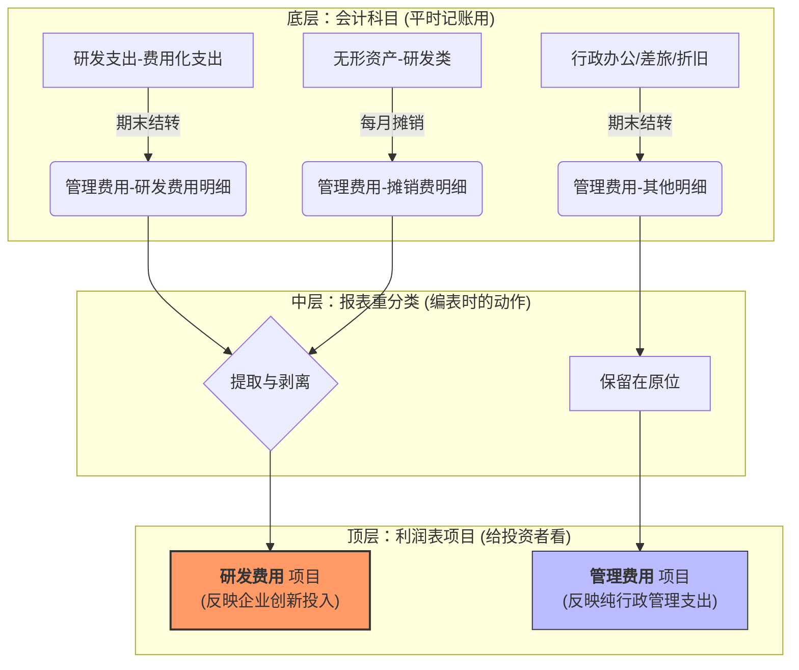

---
tags:
  - note
  - CPA/会计
笔记类型: Ref - 资源 / 摘录 / 工具
关联领域: "[[职业]]"
关联项目: "[[251214CPA会计]]"
笔记状态:
  - 🌳 Evergreen
创建时间: 2025-12-29T21:08
完成时间: 2025-12-31
---


## 第一节 无形资产的确认和初始计量

### 一、无形资产的定义与基本特征  
无形资产，是指企业拥有或者控制的没有实物形态的可辨认非货币性资产。  
**特征**：  
1. **不具有实物形态**  
2. **具有可辨认性**（商誉因不可辨认，不属于无形资产）  
3. **属于非货币性资产**  

### 二、无形资产的确认条件  
需同时满足：  
- 与该无形资产有关的经济利益很可能流入企业  
- 该无形资产的成本能够可靠地计量  
> [!example]- 例题
> 1. 下列关于无形资产的表述中，正确的是 ( )。  
>     A. 无形资产的特征是不具有实物形态，同时不具有可辨认性  
>     B. 无形资产主要包括专利权、商标权、**企业内部自创品牌**、土地使用权等  
>     C. 企业吸收合并中确认的商誉不应确认为无形资产  
>     D. 企业合并中取得的无形资产如果本身可以单独辨认，则应将其单独确认为一项无形资产
> 
> 
> **正确答案：c
> **详细解析：
> - **选项 B 错误**：无形资产主要包括专利权、商标权、著作权、土地使用权、特许经营权等。然而，**企业内部产生的品牌、客户名单、客户关系等（即企业内部自创品牌）通常不确认为无形资产**，除非它们是通过企业合并等方式取得的。这是因为内部产生的这些项目难以满足可辨认性或可计量性（可靠计量其成本）的要求。
>     
> - **选项 D **：企业合并中取得的无形资产本身可以单独辨认，但其计量或处置必须与有形的或其他无形的资产一并作价时，不应该单独确认为一项无形资产，只有当无形资产即可以单独辨认又可以单独计量时，才能确认为一项无形资产。

### 三、无形资产的初始计量  

#### （一）外购无形资产  
**成本构成**：  
- 购买价款  
- 相关税费  
- 使无形资产达到预定用途所发生的专业服务费用、测试费用等  

**不构成成本的情形**（计入当期损益）：  
- 为引入新产品发生的广告费、管理费用等间接费用  
- 无形资产达到预定用途后发生的费用（如初始运作损失）  
#### （二）投资者投入的无形资产  
- 按投资合同或协议约定价值确定，**约定价值不公允的按公允价值计量**  
- 公允价值与约定价值的差额计入资本公积  
1. **确认资产（按公允价值）**：  
    借：无形资产 —— 特许经营权 900
2. **确认实收资本（按约定份额）**：  
    贷：实收资本 800
3. **挤出差额（计入资本公积）**：  
    贷：资本公积 —— 资本溢价 100 （900 - 800）
#### （三）土地使用权的会计处理  
1. **一般情形**：确认为无形资产，按取得成本计量  
2. **自行开发建造厂房**：土地使用权与地上建筑物分别摊销和折旧  
   - **例外**：房地产企业用于建造对外出售房屋的土地使用权→计入开发成本  
   - **例外**：外购房屋价款无法在土地与建筑物间合理分配→全部作为固定资产  
3. **用途转换**：停止自用转为出租或资本增值时→转为投资性房地产  
- 相关链接：[[土地使用权的入账]]
#### （四）企业合并中取得的无形资产  
- **同一控制下**：按被合并方无形资产在最终控制方合并报表中的账面价值计量  
- **非同一控制下**：按购买日公允价值计量，包括被购买方原未确认但可单独辨认的无形资产（如正在进行的研发项目）  

## 第二节 内部研究开发支出的确认和计量  

### 一、研究阶段与开发阶段的划分  
| **研究阶段**       | **开发阶段**               |
| -------------- | ---------------------- |
| 探索性、计划性，具有不确定性 | 已完成研究，具备商业前景，形成成果可能性较大 |
| **全部费用化**      | **符合条件资本化，否则费用化**      |

### 二、开发阶段支出资本化的条件（需同时满足）  
1. 技术上具有可行性  
2. 管理层具有完成并使用/出售的意图  
3. 能证明经济利益流入方式（如产品存在市场）  
4. 有足够资源支持完成开发  
5. 支出能够可靠计量  

### 三、内部开发无形资产的计量  
**成本构成**：  
- 开发耗用的材料、劳务成本、注册费  
- 使用其他专利权的摊销、资本化利息等  

**不构成成本的情形**：  
- 销售费用、管理费用等间接费用  
- 无效运作损失、培训支出  
	- 会计准则规定，只有为使无形资产达到预定用途所发生的**必要、直接相关**的支出才能资本化。无效运作损失不具备“产生未来经济利益”的能力，因此不能增加资产的价值，必须在发生当期直接计入**损益（当期费用）**。
	- 如果允许将无效损失计入资产，企业就可以通过“把损失藏进资产负债表”的方式来粉饰利润表。这会导致企业明明经营效率低下，账面利润却看起来很健康。
	- *资产是“功劳”，无效损失是“苦劳”。会计只为“功劳”买单，不为“苦劳”记账。*

**提示**：已费用化的研发支出不得在后续期间重新资本化。  

### 四、会计处理  
#### （一）基本原则  
1. 研究阶段支出→**费用化**（管理费用）  
2. 开发阶段符合资本化条件的支出→**资本化**（研发支出—资本化支出）  
3. 无法区分研究与开发阶段的支出→全部费用化  

#### （二）账务处理  
```  
借：研发支出—费用化支出（不满足资本化条件）  
         —资本化支出（满足资本化条件）  
  贷：原材料/银行存款/应付职工薪酬  

期末：  
借：管理费用—研究费用  
  贷：研发支出—费用化支出  

达到预定用途时：  
借：无形资产  
  贷：研发支出—资本化支出  
```  

## 第三节 无形资产的后续计量  

### 一、基本原则  
- **使用寿命有限**：按经济利益预期消耗方式摊销（如直线法、产量法）  
- **使用寿命不确定**：不摊销，但至少每年进行减值测试  
	- 无形资产使用寿命的变更，应作为**会计估计变更**处理，不需要追溯调整

### 二、使用寿命有限的无形资产  
1. **摊销方法**：反映经济利益预期消耗方式（通常采用直线法）  
   - 例外：有确凿证据表明收入与经济利益消耗高度相关时，可按收入比例摊销  
2. **摊销期限**：自可供使用时起至不再作为无形资产确认时止  
3. **摊销去向**：  
   - 一般计入当期损益（管理费用/其他业务成本）  
   - 用于生产产品的→计入产品成本  

### 三、使用寿命不确定的无形资产  
- **不摊销**，但需每年进行减值测试  
- 减值测试方法：可收回金额（公允价值-处置费用 vs 预计未来现金流量现值）  

> [!example]- 例题
> 2×20年7月1日，甲公司购入一项无形资产，支付价款800万元。甲公司预计该无形资产的使用寿命无法确定。按照税法规定，该无形资产应按照20年计提摊销，预计净残值为0。2×21年12月31日，甲公司对其进行减值测试时确定其可收回金额为750万元。假定不考虑其他因素，2×21年12月31日，该无形资产的列报金额为（　）。
> 使用寿命无法确定的无形资产无需计提摊销，但是应当至少于每年年度终了时进行减值测试。  
> 2×21年12月31日该无形资产的可收回金额为750万元，小于其成本800万元，应该计提减值准备＝800－750＝50（万元），因此该无形资产的列报金额＝800－50＝750（万元）。

### 四、无形资产的减值  
- **减值损失**=账面价值-可收回金额  
- **会计分录**：  
  ```  
  借：资产减值损失  
    贷：无形资产减值准备  
  ```  
- **注意**：减值损失一经确认，**以后期间不得转回**  

## 第四节 无形资产的处置  

### 一、无形资产的出售  
```  
借：银行存款  
    累计摊销  
    无形资产减值准备  
  贷：无形资产  
    应交税费—应交增值税（销项税额）  
    资产处置损益（差额，或借方）  
```  

### 二、无形资产的报废  
当无形资产预期不能为企业带来经济利益时：  
```  
借：营业外支出（账面价值）  
    累计摊销  
    无形资产减值准备  
  贷：无形资产  
```  

## 第五节 无形资产的列示与披露  

### 一、财务报表列示  
1. **资产负债表**：  
   - “无形资产”项目：账面价值（原值-累计摊销-减值准备）  
   - “开发支出”项目：“研发支出—资本化支出”期末余额  
2. **利润表**：  
   - “研发费用”项目：费用化研发支出+研发用的无形资产摊销  

**研发费用与管理费用的列示：**

### 二、披露要求  
- 无形资产的使用寿命、摊销方法  
- 使用寿命不确定无形资产的判断依据  
- 研发支出资本化的判断依据及金额  
